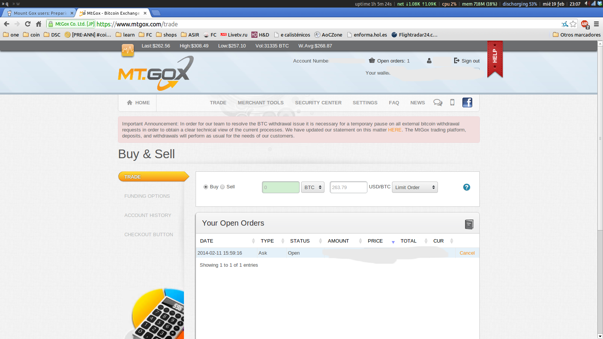

Hola! I’m Manuel, a Linux enthusiast with a diverse background. I started from the very bottom, as a level 1 technical support. Back then, I was already using Linux, I loved all the freedom it offered, the ability to choose precisely which components were installed, their configuration, and how and when they ran. I liked that everything could be done from a terminal, and the [UNIX philosophy](https://en.wikipedia.org/wiki/Unix_philosophy), where all the pieces fit together.

Despite my enthusiasm and knowledge, I faced challenges in securing a more suitable job opportunity. Self-promotion has never been my strong suit.

I even have a screenshot from February 2014 of my former desktop, where I was using [i3wm](https://i3wm.org/). As you can see I was one of the unfortunate individuals who had [Bitcoin](https://es.wikipedia.org/wiki/Bitcoin) on [Mt.Gox](https://en.wikipedia.org/wiki/Mt._Gox) back then.

Anyway, I spent only a short time working in technical support. I quickly made the leap to a level 2 role, where I had the opportunity to work directly with UNIX systems, focusing on resolving issues for systems and applications.

Meanwhile, I was already tinkering with programming. I began creating small C programs and a lot of bash scripts, but the real 'aha' moment came when I discovered Python, I love how easily you can manipulate data in Python and its REPL.
Python became my go-to language for a wide range of tasks, from automating routine processes to crafting intricate data-driven solutions.

As I continued developing my skills, I transitioned from a SysAdmin into a DevOps engineer. One of the pivotal shifts during this phase was my embrace of containerization. I began incorporating containers into my daily workflow using Docker and Podman, and my programming skills to develop CI/CD pipelines to automate deployments.

I firmly believe that the learning process is a lifelong commitment, especially in the ever-evolving world of technology. To me, being a great engineer means continually expanding my knowledge and skills.

I’m passionate about problem-solving, and I enjoy the process of digging into issues, reading documentation, testing, and piecing together solutions. That's what keeps me in this field.

Besides technology, I’m all about hiking and outdoor adventures, finding solace in nature. Back home, I like to play Metroidvania games or watching a good movie.
