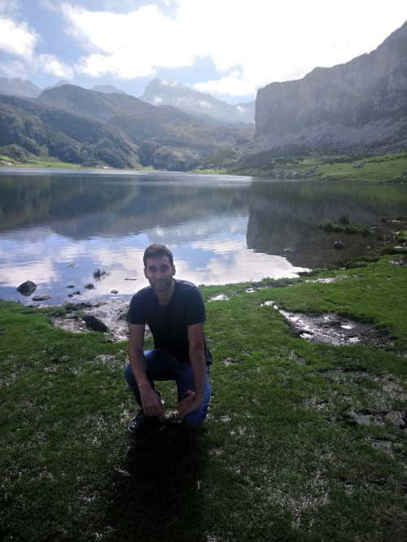





Hola! I'm Manuel, a DevOps engineer from Spain.

Things that I enjoy:

- Walking through natural settings: along the beach, on hiking trails, or in environments that allow me to disconnect.
- Playing games like [Hollow Knight](https://en.wikipedia.org/wiki/Hollow_Knight), [Blasphemous](<https://en.wikipedia.org/wiki/Blasphemous_(video_game)>) and [Age of Empires II](https://en.wikipedia.org/wiki/Age_of_Empires_II).
- Python, Go, [Nix/NixOS](https://nixos.org/), [Neovim](https://github.com/aorith/neovim-flake), tweaking my [dotfiles](https://github.com/aorith/dotfiles) and contributing to opensource when time and skill is on my side.

That's all I wanted to tell you :) if you want to reach me, you can do it using the social links below.







