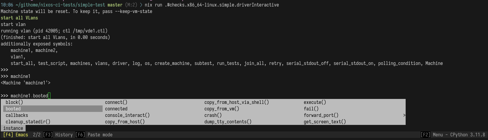
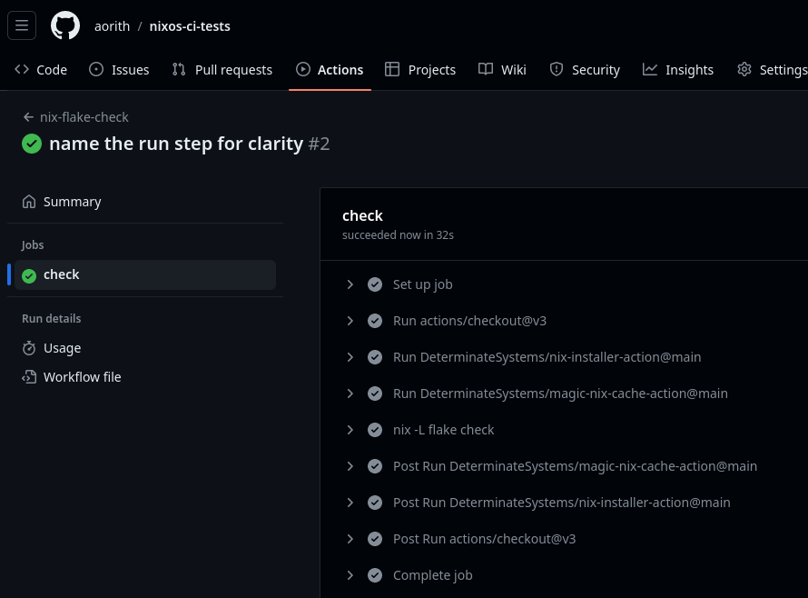

NixOS and its ecosystem offer a robust tool known as the [NixOS Integration Test Framework](https://nixos.org/manual/nixos/stable/index.html#sec-nixos-tests), which is the backbone for [testing NixOS modules and packages](https://github.com/NixOS/nixpkgs/tree/master/nixos/tests).
This framework has the capability to orchestrate multiple virtual machines within virtual networks, where each machine is configured declaratively. The tests are scripted in Python, providing a suite of objects for interacting with and testing each machine.

This is a dream come true for a DevOps engineer, as it simplifies the process of creating and managing test environments.

In this blog post, I'll walk through the process of creating a test for a basic Go application. It's important to note that I'll be using [flakes](https://nix.dev/concepts/flakes.html) in all the examples, so a basic understanding of them is recommended.

Finally I'll demonstrate how this can be integrated in a pipeline using GitHub actions.

## Getting Started with a Simple Test

To illustrate the process, we'll begin with a straightforward example. This will demonstrate how to execute tests using a nix flake.

All the files for this example can be found [here](https://github.com/aorith/nixos-ci-tests/tree/master/simple-test).

Create a file named `test.nix`. This file is a normal derivation initiated using [pkgs.nixosTest](https://nixos.org/manual/nixpkgs/stable/#tester-nixosTest) (alias of `pkgs.testers.nixosTest`), which is one of the helper functions for running tests.

```nix {hl_lines=[5,14]}
{pkgs}:
pkgs.nixosTest {
  name = "Simple ping test";

  nodes = {
    # We don't need to add anything to the system configuration of the machines
    machine1 = {...}: {};
    machine2 = {...}: {};
  };

  # Inside of 'testScript', machine1 and machine2 are available as python objects
  # which have useful functions for performing tests.
  # Their name is also resolved in the virtual network.
  testScript = ''
    machine1.wait_for_unit("network-online.target")
    machine2.wait_for_unit("network-online.target")

    # Ping each machine
    machine1.succeed("ping -c 2 machine2")
    machine2.succeed("ping -c 2 machine1")
  '';
}
```

A test has two main options: `nodes`, which specifies the machines and their
configurations, and `testScript`, a piece of Python code that defines the actual test.

Each machine in nodes actually spawns a QEMU based VM to run the tests.

Now, create a `flake.nix` file and add this test as a check:

```nix {hl_lines=[11]}
{
  description = "Very simple NixOS test";
  inputs.nixpkgs.url = "github:NixOS/nixpkgs/nixos-unstable";

  outputs = inputs: let
    forAllSystems = inputs.nixpkgs.lib.genAttrs ["aarch64-darwin" "aarch64-linux" "x86_64-darwin" "x86_64-linux"];
  in {
    checks = forAllSystems (system: let
      pkgs = import inputs.nixpkgs {inherit system;};
    in {
      simple = pkgs.callPackage ./test.nix {inherit pkgs;};
    });
  };
}
```

When we run `nix flake show`, we can see that it implements a single check named
`simple`. We could define multiple checks if we wanted to.

```sh
$ nix flake show
git+file:///home/aorith/githome/nixos-ci-tests?dir=simple-test&ref=refs/heads/master&rev=06a4d408e742369ef1757f73d1b977459f7d4290
└───checks
    ├───aarch64-darwin
    │   └───simple omitted (use '--all-systems' to show)
    ├───aarch64-linux
    │   └───simple omitted (use '--all-systems' to show)
    ├───x86_64-darwin
    │   └───simple omitted (use '--all-systems' to show)
    └───x86_64-linux
        └───simple: derivation 'vm-test-run-Simple-ping-test'
```

### Executing the test

To run the test, we use the command `nix flake check`, which executes all the checks specified under the `checks` attribute, among other validations.

When we run the test for the first time, we should see an output similar to the following:

```sh
$ nix -L flake check
nixos-test-driver-Simple-ping-test> Running type check (enable/disable: config.skipTypeCheck)
nixos-test-driver-Simple-ping-test> See https://nixos.org/manual/nixos/stable/#test-opt-skipTypeCheck

. . .

vm-test-run-Simple-ping-test> (finished: waiting for unit network-online.target, in 9.37 seconds)
vm-test-run-Simple-ping-test> machine1: must succeed: ping -c 3 machine2
vm-test-run-Simple-ping-test> (finished: must succeed: ping -c 3 machine2, in 2.09 seconds)
vm-test-run-Simple-ping-test> machine2: must succeed: ping -c 3 machine1
vm-test-run-Simple-ping-test> (finished: must succeed: ping -c 3 machine1, in 2.03 seconds)
vm-test-run-Simple-ping-test> (finished: run the VM test script, in 21.61 seconds)
vm-test-run-Simple-ping-test> test script finished in 21.67s
vm-test-run-Simple-ping-test> cleanup
vm-test-run-Simple-ping-test> kill machine (pid 9)
vm-test-run-Simple-ping-test> qemu-kvm: terminating on signal 15 from pid 6 (/nix/store/sxr2igfkwhxbagri49b8krmcqz168sim-python3-3.11.8/bin/python3.11)
vm-test-run-Simple-ping-test> kill machine (pid 42)
vm-test-run-Simple-ping-test> qemu-kvm: terminating on signal 15 from pid 6 (/nix/store/sxr2igfkwhxbagri49b8krmcqz168sim-python3-3.11.8/bin/python3.11)
vm-test-run-Simple-ping-test> (finished: cleanup, in 0.02 seconds)
vm-test-run-Simple-ping-test> kill vlan (pid 7)
warning: The check omitted these incompatible systems: aarch64-darwin, aarch64-linux, x86_64-darwin
Use '--all-systems' to check all.
```

If the test is successful the exit code will be 0 as expected.

Subsequent runs may utilize the cached results, skipping the test execution.

### Debugging

For complex tests, we can execute an interactive python REPL with all the objects of `testScript`. This helps debugging and ensuring that the tests work as expected:

```sh
$ nix run .#checks.x86_64-linux.simple.driverInteractive
```

Replace `x86_64-linux` when running on a different architecture.



Now we're ready to tackle more complex test example.

## Testing a Go application

Now I'll demonstrate how to test a basic Go application. This will include the following steps:

1. Develop a basic Go application and packaging it with a [nix derivation](https://nixos.org/manual/nix/stable/language/derivations.html).
2. Implement a NixOS module.
3. Write the integration test.
4. Integrate everything within a nix flake.

The full code for this example can be found [here](https://github.com/aorith/nixos-ci-tests/tree/master/echo-server).

### Implementing the Go Application

First, we'll start by setting up our Go application. This involves initializing a new Go project and writing a simple "echo" TCP server that sends back whatever input it receives. To bootstrap the application, use the following commands:

```sh
$ mkdir -p echo-server/src
$ cd echo-server/src
$ go mod init example/echo-server
```

Here's the `main.go` file for the echo server, don't pay too much attention to
it, it's just an example:

```go
package main

import (
	"bufio"
	"flag"
	"fmt"
	"net"
	"os"
	"strconv"
)

func main() {
	port := flag.Int("port", 8080, "port to listen on")
	flag.Parse()

	if *port < 1024 || *port > 65535 {
		fmt.Println("Port number must be between 1024 and 65535.")
		os.Exit(1)
	}

	listener, err := net.Listen("tcp", ":"+strconv.Itoa(*port))
	if err != nil {
		fmt.Println("Error starting the server:", err)
		os.Exit(1)
	}
	defer listener.Close()
	fmt.Printf("Server is listening on port %s\n", strconv.Itoa(*port))

	for {
		conn, err := listener.Accept()
		if err != nil {
			fmt.Println("Error accepting connection:", err)
			continue
		}

		go handleConnection(conn)
	}
}

func handleConnection(conn net.Conn) {
	defer conn.Close()
	scanner := bufio.NewScanner(conn)
	for scanner.Scan() {
		text := scanner.Text()
		fmt.Println("Received:", text)
		if _, err := conn.Write([]byte(text + "\n")); err != nil {
			fmt.Println("Error writing output:", err)
		}
	}
	if err := scanner.Err(); err != nil {
		fmt.Println("Error reading from connection:", err)
	}
}
```

To test the server locally, run it in a terminal:

```sh
$ go run main.go --port=8222
Server is listening on port 8222
```

Then, in another terminal window, send some text to it using netcat:

```sh
$ echo hello | nc -Nn 127.0.0.1 8222
hello
```

The server should receive and echo the text:

```sh
$ go run main.go --port=8222
Server is listening on port 8222
Received: hello
```

### Packaging the Go application

Now we need to package this Go application, we'll use [pkgs.buildGoModule](https://nixos.org/manual/nixpkgs/stable/#ssec-language-go), it's pretty straightforward:

```nix
# ./echo-server/echo-server.nix
{pkgs ? import <nixpkgs> {}}:
pkgs.buildGoModule {
  name = "echo-server";
  src = ./src;
  vendorHash = null;
}
```

You can build the packaged application with `nix-build`:

```sh
$ nix-build echo-server.nix
/nix/store/nd580rgkk7smarw940lbj5k1vwbdgzck-echo-server
$ ./result/bin/echo-server
Server is listening on port 8080
```

### Creating a NixOS Module

We'll now create a NixOS module for our application.
This module will set up our application as a systemd service and include an option to customize the listening port.
The "server" machine in our test will include this module to start the application.

Create a file named `echo-server/echo-server-module.nix` with the following content:

```nix
{
  config,
  pkgs,
  lib,
  ...
}: let
  cfg = config.services.echo-server;
in {
  options.services.echo-server = {
    enable = lib.mkEnableOption "echo-server";
    port = lib.mkOption {
      type = lib.types.port;
      default = 8123;
      description = "Port to listen on";
    };
  };

  config = lib.mkIf cfg.enable {
    systemd.services.echo-server = {
      description = "TCP Echo Server Daemon";
      serviceConfig = {
        ExecStart = "${pkgs.echo-server}/bin/echo-server --port=${builtins.toString cfg.port}";
      };
      wantedBy = ["multi-user.target"];
    };
  };
}
```

Here, `options.services.echo-server` defines new config options that the NixOS
configuration importing this module will have available, and `config` conditionally
creates the required systemd service if the option is enabled.

### Implementing the test

For testing, we want to simulate a scenario with two machines: one running our echo server and the other sending messages to it. We'll write a test in Nix that sets up these machines and checks if the communication works as expected:

Create a file named `echo-server/tests/echo-server.nix`:

```nix
{
  self,
  pkgs,
}:
pkgs.nixosTest {
  name = "Echo Server Service Test";

  nodes = {
    # Machine 1: The server that will run the service
    server = {config, ...}: {
      imports = [self.nixosModules.echo-server];

      # Configure the service
      services.echo-server = {
        enable = true;
        port = 8222;
      };

      networking.firewall.allowedTCPPorts = [
        config.services.echo-server.port
      ];
    };

    # Machine 2: The client that will connect to the echo-server service
    # netcat (nc) is already available in the 'libressl' package.
    client = {...}: {};
  };

  globalTimeout = 20; # Test time limit

  testScript = {nodes, ...}: ''
    PORT = ${builtins.toString nodes.server.services.echo-server.port}
    TEST_STRING = "Test string. The server should echo it back."

    start_all()

    # Wait until VMs are up and the service is started.
    server.wait_for_unit("echo-server.service")
    server.wait_for_open_port(${builtins.toString nodes.server.services.echo-server.port})
    client.wait_for_unit("network-online.target")

    # The actual test sends an arbitrary string and expects to find it in the output
    output = client.succeed(f"echo '{TEST_STRING}' | nc -4 -N server {PORT}")
    assert TEST_STRING in output
  '';
}
```

As you can see, with less that 50 lines of code we have a test that spins two
virtual machines.

One of them starts our application with a custom listening port:

```nix {hl_lines=[4,"7-10",13]}
  nodes = {
    # Machine 1: The server that will run the service
    server = {config, ...}: {
      imports = [self.nixosModules.echo-server];

      # Configure the service
      services.echo-server = {
        enable = true;
        port = 8222;
      };

      networking.firewall.allowedTCPPorts = [
        config.services.echo-server.port
      ];
```

Notice how for this machine we import the "echo-server" module (you'll see later
how it's present in the `self` property) then we enable and
configure it. Lastly we open the firewall port by referencing this same configuration.

The client machine doesn't need any configuration, we just declare it:

```nix {hl_lines=[3]}
    # Machine 2: The client that will connect to the echo-server service
    # netcat (nc) is already available in the 'libressl' package.
    client = {...}: {};
```

Finally, test ensures that the service is running, the port is listening and the text received matches:

```nix {hl_lines=["8-10","13-14"]}
  testScript = {nodes, ...}: ''
    PORT = ${builtins.toString nodes.server.services.echo-server.port}
    TEST_STRING = "Test string. The server should echo it back."

    start_all()

    # Wait until VMs are up and the service is started.
    server.wait_for_unit("echo-server.service")
    server.wait_for_open_port(${builtins.toString nodes.server.services.echo-server.port})
    client.wait_for_unit("network-online.target")

    # The actual test sends an arbitrary string and expects to find it in the output
    output = client.succeed(f"echo '{TEST_STRING}' | nc -4 -N server {PORT}")
    assert TEST_STRING in output
  '';
}
```

### Consolidating in a nix flake

Now we'll put together all the components into a nix flake.

Create a file named `flake.nix`, the folder estructure should be like this:

```sh {hl_lines=[11]}
.
├── echo-server
│   ├── echo-server-module.nix
│   ├── echo-server.nix
│   ├── src
│   │   ├── go.mod
│   │   └── main.go
│   └── tests
│       └── echo-server.nix
├── flake.lock
└── flake.nix
```

The content of the `flake.nix` file is:

```nix {linenos=true,hl_lines=["14-16",18,22,25]}
{
  description = "NixOS integration tests example";

  inputs = {
    nixpkgs.url = "github:NixOS/nixpkgs?ref=nixos-unstable";
  };

  outputs = {
    self,
    nixpkgs,
    ...
  }: let
    forAllSystems = nixpkgs.lib.genAttrs ["aarch64-darwin" "aarch64-linux" "x86_64-darwin" "x86_64-linux"];
    echoServerOverlay = final: prev: {
      echo-server = final.callPackage ./echo-server/echo-server.nix {pkgs = final;};
    };
  in {
    nixosModules.echo-server = import ./echo-server/echo-server-module.nix;
    checks = forAllSystems (system: let
      pkgs = import nixpkgs {
        inherit system;
        overlays = [echoServerOverlay];
      };
    in {
      echo-server = pkgs.callPackage ./echo-server/tests/echo-server.nix {inherit self pkgs;};
    });
  };
}
```

It's very similar to the first example, with the exception that we create an
_overlay_. The overlay adds our application as a package named "echo-server" to the nixpkgs, making
it available under `pkgs.echo-server`.

At line `18` we import the "echo-server" module as a NixOS module, this
allows to reference it as `self.nixosModules.echo-server`. The attribute `self`
references the whole flake.

Then at line `25` the test is called with the required arguments.

Now run `nix flake show`, you should see an output similar to the following:

```sh
$ nix flake show
git+file:///home/aorith/githome/nixos-ci-tests?dir=echo-server
├───checks
│   ├───aarch64-darwin
│   │   └───echo-server omitted (use '--all-systems' to show)
│   ├───aarch64-linux
│   │   └───echo-server omitted (use '--all-systems' to show)
│   ├───x86_64-darwin
│   │   └───echo-server omitted (use '--all-systems' to show)
│   └───x86_64-linux
│       └───echo-server: derivation 'vm-test-run-Echo-Server-Service-Test'
└───nixosModules
    └───echo-server: NixOS module
```

Following these steps should enable you to run the integration test for your Go application using NixOS's testing framework.

```sh
$ nix -L flake check
```

Here's a short video running the test:


<video controls>

  <source src="nix-flake-check.webm" type="video/webm" />
  Download the
  <a href="nix-flake-check.webm">WEBM</a>
  video.
</video>


## Integrating into GitHub Actions

Integrating your NixOS tests into GitHub Actions is a straightforward process. This ensures your code is automatically verified before any merges and ensures reproducibility. With Nix/NixOS, another advantage is the uniformity of testing command, you always run `nix flake check`, locally or within a CI pipeline.

To set up a GitHub Actions workflow that utilizes Nix for running checks, follow these steps:

1. Create a new file in your repository under `.github/workflows/`, naming it something like `nix-check.yaml`.
2. Insert the following content, which defines a workflow that triggers manually, on pushes or pull requests:

```yaml
name: nix-flake-check
on:
  workflow_dispatch:
  push:
  pull_request:
jobs:
  check:
    runs-on: ubuntu-latest
    steps:
      - uses: actions/checkout@v3
      - uses: DeterminateSystems/nix-installer-action@main
      - uses: DeterminateSystems/magic-nix-cache-action@main
      - run: |
          cd echo-server || exit 1
          nix -L flake check
```

This workflow includes steps to install Nix and execute the tests.

Depending where in your repository is located the `flake.nix` file you'll need the initial `cd` or not.



## References

I have used multiple sources to write this post and similar examples can be found in [nixcademy](https://nixcademy.com).

- [NixOS manual](https://nixos.org/manual/nixpkgs/stable/)
- https://blog.thalheim.io/2023/01/08/how-to-use-nixos-testing-framework-with-flakes/
- https://nixcademy.com/2024/03/01/nixos-integration-test-on-github/
